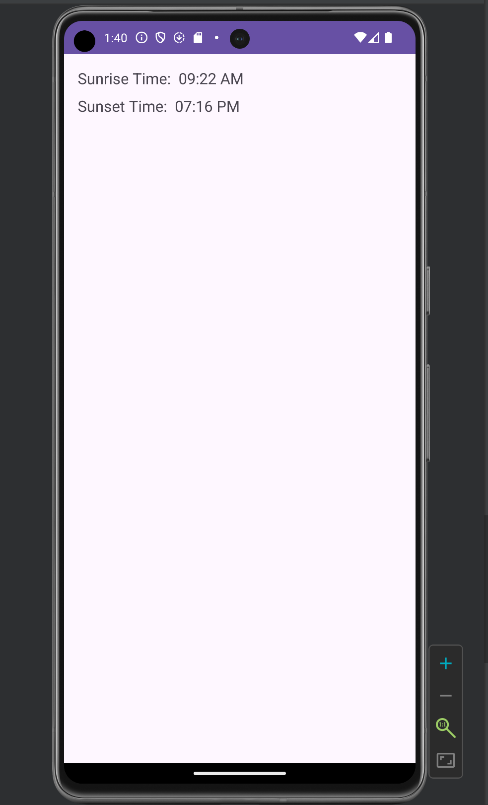
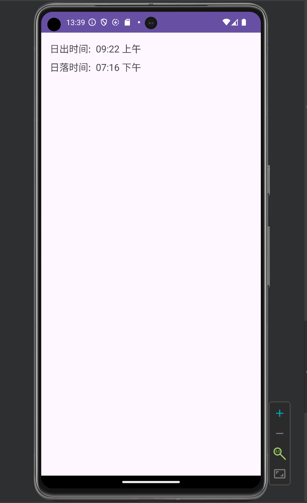

# Sunriseset
This application is used to fetch data from the sunrise-sunset API located at : (https://sunrise-sunset.org/api), and then can dynamically display the time in both English and Chinese locale based on the setting of the device.

## Time in English on App

## Time in Chinese on App
